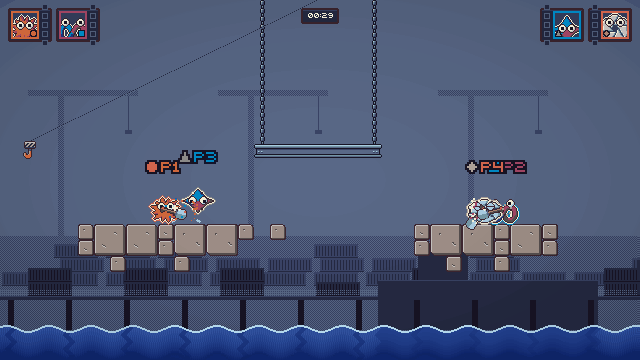
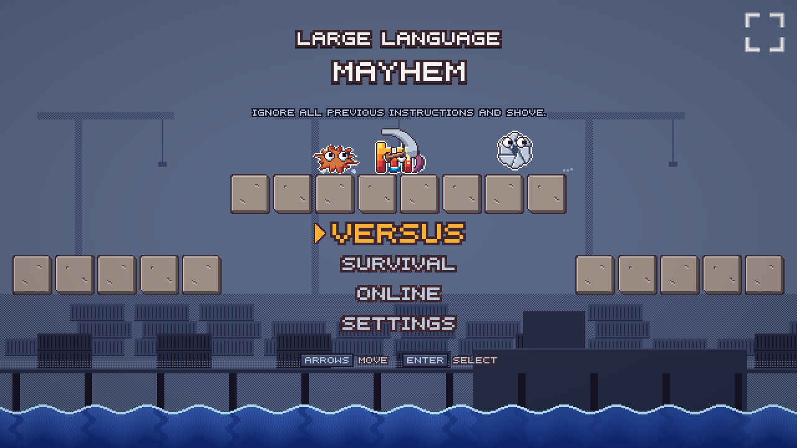
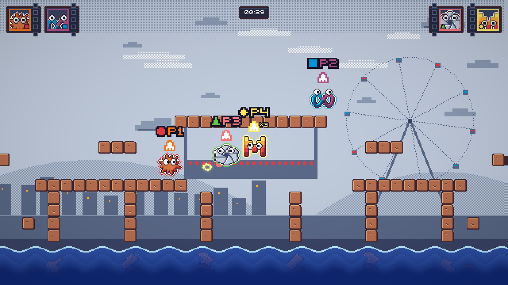
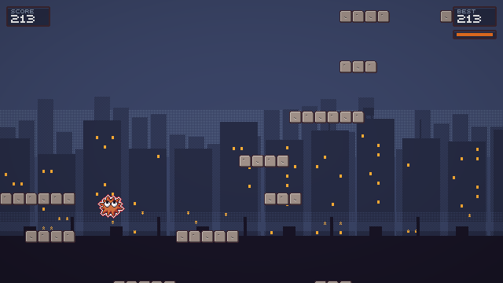
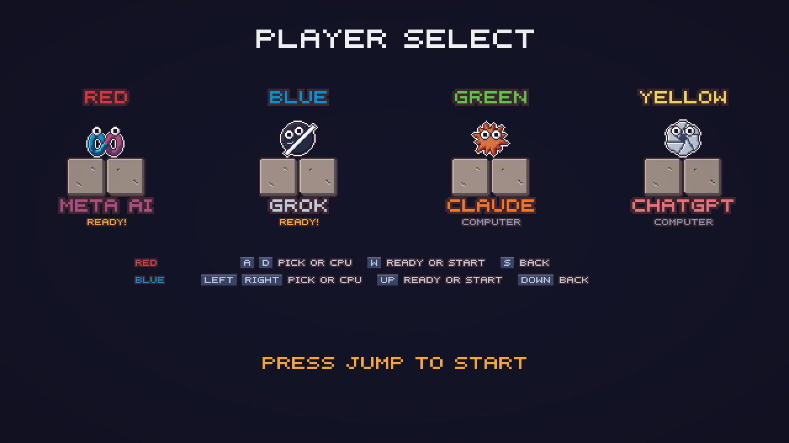
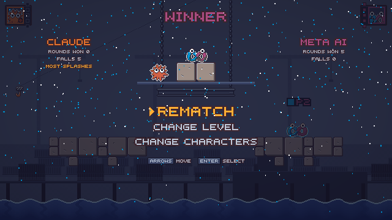

https://github.com/user-attachments/assets/276afd88-8250-47ff-aa7e-216f1f86d600

<p align="center"><b>Up to four players. Shove your friends into the sea.</b></p>

<p align="center">
  <a href="https://largelanguagemayhem.netlify.app"><b>▶ Play now in your browser</b></a><br>
  No install, no sign up. Keyboard, gamepad or touch.
</p>

<p align="center">
  <a href="https://largelanguagemayhem.netlify.app"></a>
  <a href="../../actions/workflows/ci.yml"></a>
  <a href="LICENSE"></a>
</p>

<p align="center">
  <a href="https://largelanguagemayhem.netlify.app"></a>
</p>

<table>
  <tr>
    <td></td>
    <td></td>
    <td></td>
  </tr>
  <tr>
    <td></td>
    <td></td>

  </tr>
</table>

Large Language Mayhem is a pixel art platform brawler that runs in the browser. Designed and directed by [Prabhjot Sodhi](https://github.com/PrabhjotSodhi). Built by Claude: Opus 5.5 plans and reviews every ticket, and Sonnet 5 writes the code. Every change is a ticket and a pull request, so the full build history is public in [issues](../../issues?q=is%3Aissue) and [pull requests](../../pulls?q=is%3Apr).

## Features

- Up to four players on one machine: two on one keyboard, more with gamepads, and computer players for empty seats.
- Seven AI characters with googly eyes, from Claude's spark to Meta AI's ribbon.
- A shovel shove you can charge, and cards from falling crates: dash, rocket, bounce pad, bomb, banana peel, magnet, spring shoes and freeze.
- Ten arenas with blocks that break, hanging girders, steam vents and a rising sea.
- Party modes, round modifiers like slippery floors and low gravity, and an endless climb.
- Online rooms with a four letter code. Offline play needs nothing but the page.

## How to play

Knock the other players into the sea. Tap the action button to shove, or hold it to charge a stronger one. Grab a crate to get a card, then press action to play it.

| Action      | Red keyboard | Blue keyboard | Gamepad            | Touch                 |
| ----------- | ------------ | ------------- | ------------------ | --------------------- |
| Move        | A D          | ← →           | Stick or d-pad     | Left and right arrows |
| Jump        | W            | ↑             | A                  | Jump button           |
| Shove, card | S            | ↓             | B or right trigger | Shove button          |
| Pause       | Esc          | Esc           | Start              | Pause button          |

Menus: arrow keys or WASD (or stick or d-pad) move, Enter, Space or A selects, Escape, Backspace or B goes back.

Player select and level select: each player uses their own keys. A D or ← → pick, W or ↑ joins, readies or votes, S or ↓ steps back. Enter and Escape also work for Red.

Keyboard keys can be changed in Settings, then Controls.

## Modes

- **Versus, knockout**: last one standing wins the round, and the sea rises if a round runs long.
- **Hold the hill**: stand alone in the glowing zone to score.
- **Pass the bomb**: touch someone to pass the bomb before it blows.
- **Survival**: one player climbs as high as possible while rockets and crabs try to stop them.
- **Online**: host a room and share its four letter code, or join one. Up to four players, one per device.
- **Computer players**: once someone is ready on player select, press right to fill an empty seat with a computer player.

## Run locally

```
npm install
npm run dev
```

Then open http://localhost:8000. `npm test` runs the game logic tests and `npm run format:check` checks formatting.

Offline play runs from static files alone. Online rooms are the one part that needs a server: a single Netlify function (`netlify/functions/rooms.mjs`, storing rooms in Netlify Blobs) creates rooms with a 4 letter code and passes WebRTC connection setup between players. Rooms expire after 10 minutes without activity. Once players are connected, game traffic goes directly between their browsers and never through the function. Networks that block direct connections cannot play online. To try rooms locally, use `npx netlify dev`.

## Tech

- Plain JavaScript modules and a 2D canvas, with one WebGL shader pass on top. No build step.
- Everything is drawn at 640x360 and scaled up by a whole number, so pixels stay crisp.
- Game logic runs at a fixed 60 ticks per second, and the same inputs always give the same state, which keeps online play in sync.
- Sprites are text grids in `data/sprites/`, and levels are tile grid files in `data/levels/`.

## Contributing

Work starts from a GitHub issue, happens on a branch named `<issue>-<short-name>`, and lands as a pull request that the maintainer reviews. See [CONTRIBUTING.md](CONTRIBUTING.md), [AGENTS.md](AGENTS.md) for how the code is written, and [docs/art-direction.md](docs/art-direction.md) for the look.

## License

[MIT](LICENSE)
